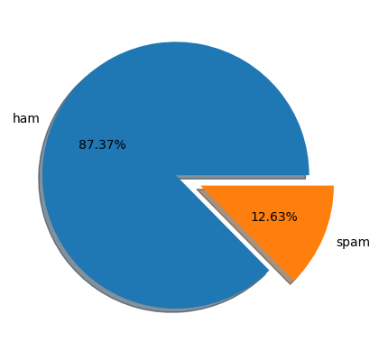
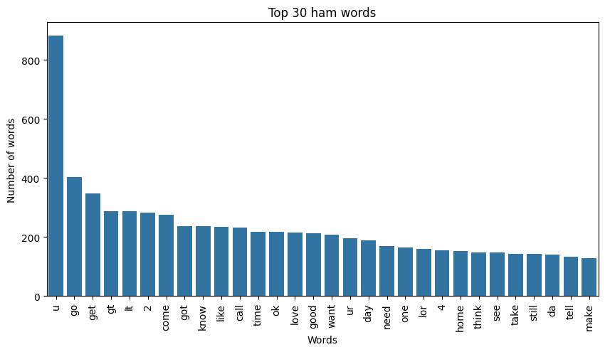
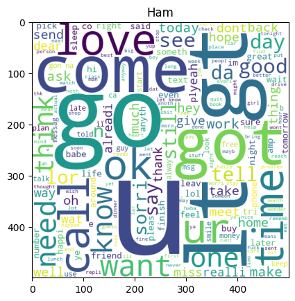
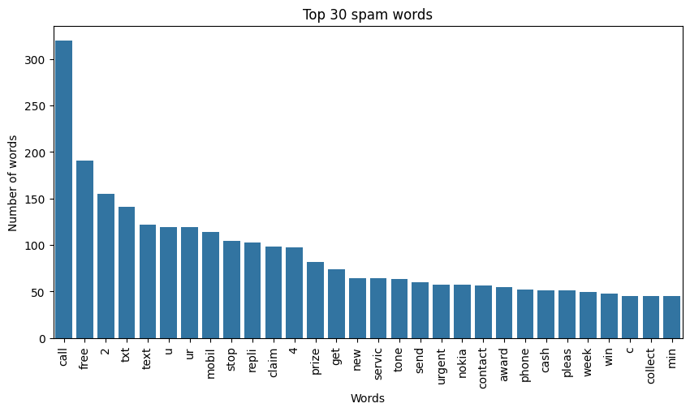
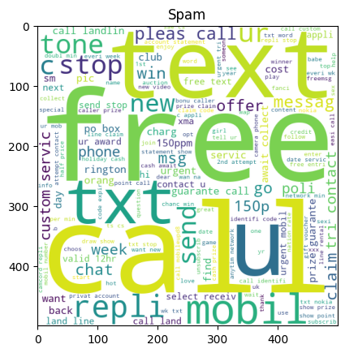

<h1>📧 Email Spam Detection System</h1>

A Machine Learning-powered Email Spam Detection System that classifies incoming messages as Spam or Ham (Not Spam) using the Multinomial Naive Bayes algorithm. The project includes data preprocessing, exploratory data analysis (EDA), model training, evaluation, and deployment support through Docker.

<h2>🚀 Features</h2>h2>
Email/SMS spam classification
Text preprocessing and cleaning
Exploratory Data Analysis (EDA)
Word frequency visualization
Word Cloud generation
Multinomial Naive Bayes classifier
Dockerized application
High-performance prediction model
<h2>📊 Model Performance</h2>h2
Metric	Score
Accuracy	98%
Precision	99%
Algorithm Used
Multinomial Naive Bayes

The Multinomial Naive Bayes model was selected because it performs exceptionally well on text classification problems and is computationally efficient.

<h2>🛠️ Tech Stack</h2>
Python
Pandas
NumPy
Matplotlib
Seaborn
NLTK
Scikit-Learn
WordCloud
Docker

<h2>📈 Exploratory Data Analysis (EDA)</h2>
Dataset Distribution

The dataset is slightly imbalanced with a significantly larger number of legitimate (ham) messages than spam messages.

Observation
Ham messages: 87.37% 
Spam messages: 12.63% 
<h3>Top 30 Most Frequent Ham Words</h3> 

Observation 

Common words in legitimate emails include: 

u, go, get, gt, lt, come, know, like, call, time

These words generally represent normal conversational communication.

</h3>Ham Word Cloud</h3> 
 

Observation

The ham messages contain words related to daily conversations, greetings, plans, and personal communication. 

<h3>Top 30 Most Frequent Spam Words</h3> 
 

Observation 

Frequently occurring spam words include: 

call,free,txt,text,mobile,claim,prize,service,urgent

These words are commonly associated with promotional, scam, or marketing messages. 

<h3>Spam Word Cloud</h3> 
 

Observation 

Spam messages prominently contain words such as: 

free,claim,prize,mobile,urgent,service,contact
